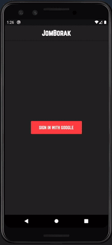

# JomBorak


<p align="center">
  
</p>

:star2::star2: **Don't forget to give this repo a star!** :star2::star2:

## Description
Chat Messaging App with Flutter include with Google Firebase as database.

***Instruction on usage:***
````
1. Clone or download this repositories
2. Unzip and open with TextEditor (VS Code)
3. Create new firebase and connect it with your app
4. If you like to use Google sign-in, get SHA-1 key. Enter this command in terminal:
  -keytool -exportcert -v \-alias androiddebugkey -keystore %USERPROFILE%\.android\debug.keystore
  -keytool -list -v \-alias androiddebugkey -keystore %USERPROFILE%\.android\debug.keystore
5. For iOS, add this code --> #import <Firebase/Firebase.h> in AppDelegate.h
6. Read chat app documentation.doc in root folder
7. Run! --> flutter run
````

Check out references:
> Medium.com [This Link](https://medium.com/flutter-community/building-a-chat-app-with-flutter-and-firebase-from-scratch-9eaa7f41782e).
> Github [This Link](https://github.com/duytq94/flutter-chat-demo).

## List of Features
- [x] Google Firebase
- [x] Chat Messaging
- [x] Gif
- [x] Login with Gmail
